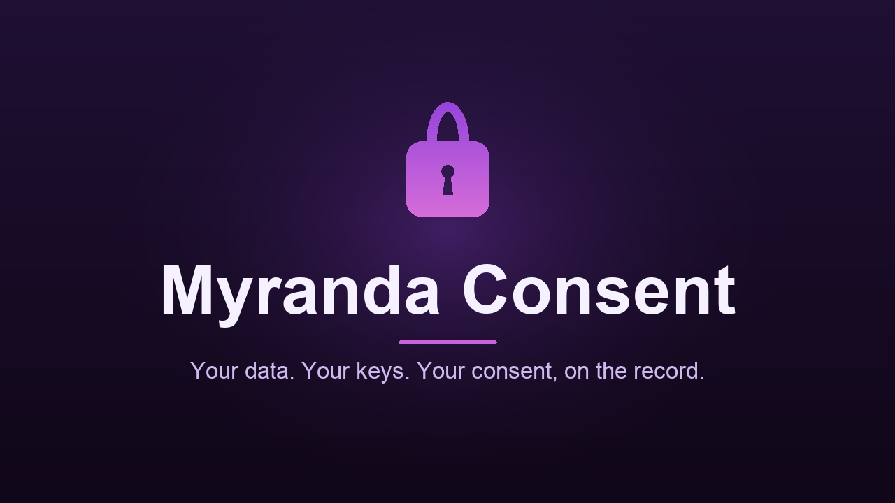

# Myranda Consent



> Your data. Your keys. Your consent, on the record.

**Live demo:** https://myranda-consent.vercel.app
**Repo:** https://github.com/myranda-jasper/myranda-consent

Myranda Consent is an open-source demo of **user-owned consent**. You sign in
with your own wallet, your data export is encrypted in your browser with a key
**only your wallet can recreate**, you sign a consent receipt, and the encrypted
data is stored on decentralized storage. Your consent is a cryptographic
signature that **anyone can verify** — no need to trust us.

---

## What it does (in plain English)

1. **Log in** with email or a wallet like MetaMask.
2. Click **"Approve and store an export."** The app generates a small sample
   data export (a stand-in for your real personal data).
3. That export is **encrypted in your browser**. The encryption key is rebuilt
   from a signature only your wallet can produce — so only you can decrypt it.
   It's never stored or sent anywhere.
4. You **sign a consent receipt** (a structured EIP-712 message). That signature
   *is* your verifiable consent.
5. The encrypted blob is **uploaded to Walrus** (decentralized storage) and you
   get back a blob ID.
6. In **My consent history**, each receipt can be:
   - **Verified** — re-checks the signature against your address (valid / not).
   - **Fetched from Walrus** — re-downloads the blob and decrypts it, proving it
     only opens with your own signature-derived key.
7. If your wallet has an **ENS name**, receipts show **"Signed by name.eth"**
   with your avatar instead of a raw address.

Nobody but you can read the data, and anyone can confirm that you — and only you
— consented.

---

## Sponsors used, and how

| Sponsor | Role in Myranda Consent |
|---|---|
| **Privy** | Wallet + keys. Handles login (email or external wallet) and gives every user a wallet to sign with. All signing happens in the browser; no private keys ever touch our code. |
| **Walrus** | Decentralized storage. The encrypted data blob is stored on the Walrus testnet and addressed by a content blob ID. |
| **ENS** | Identity. The connected wallet's primary ENS name + avatar are resolved (read-only) and shown on each receipt. Optionally, a user can publish their latest blob ID into the ENS text record `me.myranda.consent`. |
| **EIP-712 signed receipts** | Verifiable consent. Each consent receipt is an EIP-712 typed-data signature over `{ user, action, dataCategory, timestamp, blobHash }`. The signature is the consent, and it can be verified by anyone against the signer's address. |

---

## How it works (architecture)

```
Browser (your keys never leave it)
  ├─ Privy: login + wallet (email or MetaMask)
  ├─ Encrypt: AES-GCM, key = HKDF( wallet signature of a fixed message )
  ├─ Sign: EIP-712 consent receipt (viem)               ── verifiable consent
  └─ ENS: show name + avatar; optional setText write

Next.js API routes (server-side proxy, sees only ciphertext)
  ├─ POST /api/walrus/store      → PUT  {publisher}/v1/blobs        → blob ID
  ├─ GET  /api/walrus/[blobId]   → GET  {aggregator}/v1/blobs/{id}  → bytes
  └─ GET  /api/ens/[address]     → viem reads on a public mainnet RPC
```

Key design choices:

- **No private keys in the codebase.** Everything is signed in your browser by
  your wallet.
- **The encryption key is derived from a signature**, not stored. Your wallet
  signs the fixed message `"Myranda Consent encryption key v1"`, and an AES-GCM
  key is derived from that signature with HKDF. Only your wallet can reproduce
  the signature, so only you can derive the key.
- **Walrus access is proxied** through small server routes for reliability
  (avoids browser CORS/rate-limit coupling). The server only ever sees encrypted
  bytes.
- **ENS reads are server-side** (a public mainnet RPC, reads only) and
  forward-verified, so a spoofed reverse record can't impersonate a name. The
  optional ENS write is signed by the user's wallet on mainnet (costs gas) and
  is only offered when the wallet owns its primary ENS name.

---

## Tech stack

- **Next.js 16** (App Router) + **TypeScript** + **Tailwind CSS v4**
- **Privy** (`@privy-io/react-auth`) for auth + wallets
- **viem** for signing, hashing, and ENS resolution
- **Walrus** testnet for decentralized blob storage
- **Web Crypto API** (AES-GCM, HKDF) for in-browser encryption
- Hosted on **Vercel**

---

## Run it locally

```bash
git clone https://github.com/myranda-jasper/myranda-consent.git
cd myranda-consent
npm install
cp .env.example .env.local      # then add your Privy App ID (see below)
npm run dev                     # http://localhost:3000
```

### Configure Privy (required for login)

1. Create an app at **https://dashboard.privy.io** and copy the **App ID**.
2. Put it in `.env.local`:
   ```
   NEXT_PUBLIC_PRIVY_APP_ID=your-app-id
   ```
3. In the Privy dashboard, enable **Email** and **Wallet** login methods, and
   add your domains to the allowed origins (`http://localhost:3000` and your
   deployed URL).

### Optional environment variables

Sensible defaults are baked in, so these are only needed to override them:

```
WALRUS_PUBLISHER_URL=https://publisher.walrus-testnet.walrus.space
WALRUS_AGGREGATOR_URL=https://aggregator.walrus-testnet.walrus.space
WALRUS_EPOCHS=5
MAINNET_RPC_URL=https://ethereum-rpc.publicnode.com   # ENS reads
```

---

## Notes & limitations

- This is a **hackathon demo** on **testnets**. Walrus testnet data is
  best-effort and can be wiped; blobs are stored for a limited number of epochs.
- The consent **receipt list is kept in app state** (in-memory) for now — it
  resets on reload. Persisting it is future work.
- The **sample export is synthetic** — it stands in for a real personal-data
  export.
- The optional **ENS write** sends a real Ethereum mainnet transaction (gas) and
  is only shown to wallets that own their primary ENS name.

---

## Project structure

```
app/
  page.tsx                  landing page
  app/page.tsx              the consent console
  providers.tsx             Privy provider
  api/walrus/store          upload proxy (PUT)
  api/walrus/[blobId]       download proxy (GET)
  api/ens/[address]         ENS resolution (read-only)
components/
  ConsentApp.tsx            the main flow
  ConsentHistory.tsx        history + Verify + Fetch-from-Walrus
  EnsName.tsx               "Signed by name.eth" badge
  EnsPublish.tsx            optional ENS text-record write
lib/
  crypto.ts                 AES-GCM + HKDF (signature-derived key)
  receipt.ts                EIP-712 receipt: build, sign, verify
  walrus.ts / wallet.ts / ens.ts / ensWrite.ts
```

---

## Credits

Built with **[Claude Code](https://claude.com/claude-code)**. **ChatGPT** was
used earlier in the process for planning and ideas.
